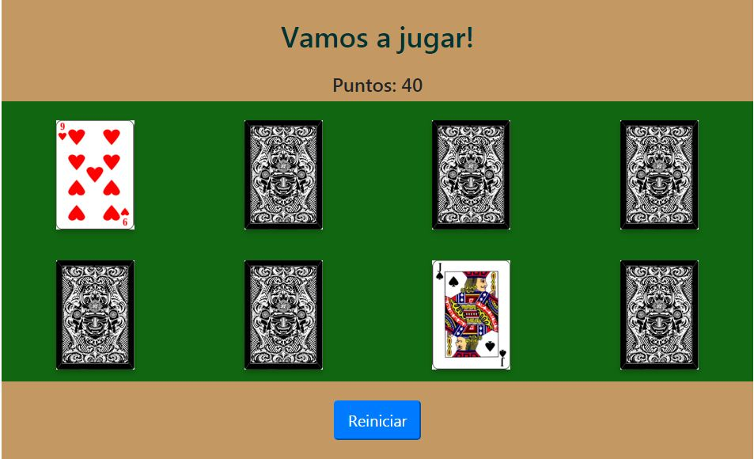

# Juego de cartas

## Instrucciones:

Para poder jugar este juego deberás desplegar el siguiente link.

[Link del juego](https://vmirella.github.io/reto-coach-juego-cartas/)

El juego es para reforzar la memoria podrás observar 8 cartas y deberás buscar parejas de cartas.

El juego comienza con 50 puntos, por cada par de cartas acertadas te suma 20 puntos, en caso de equivocarte te resta 10 puntos.

Ganas si encuentras todas las parejas de cartas. Si te quedas sin puntos pierdes el juego. 

Hay un botón que te permite reiniciar el juego.

